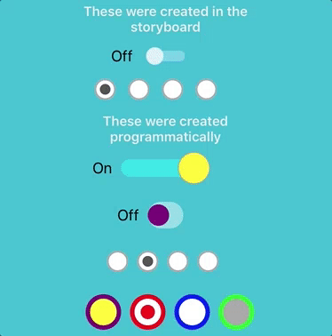
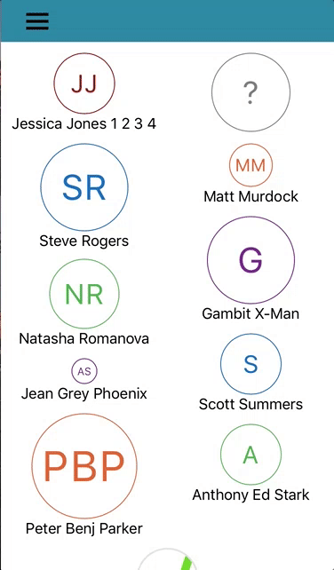
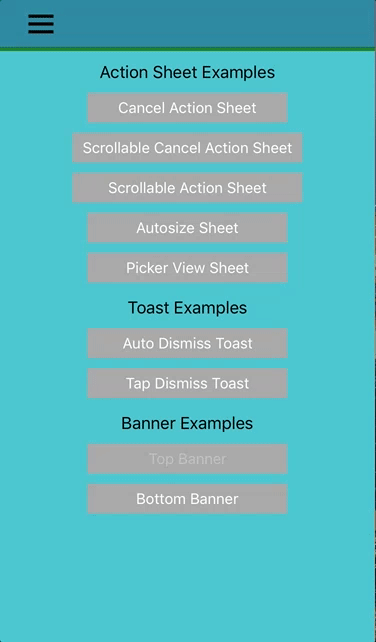
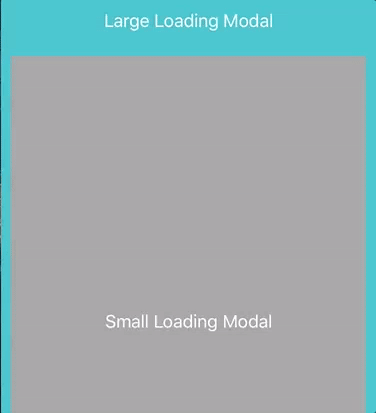
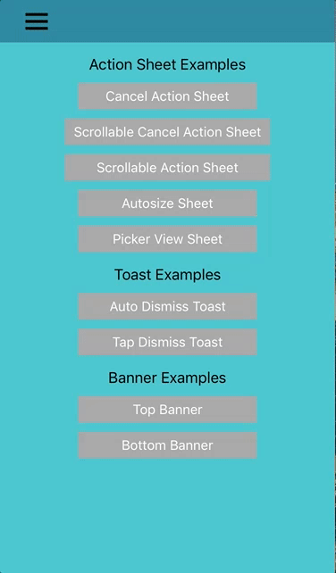
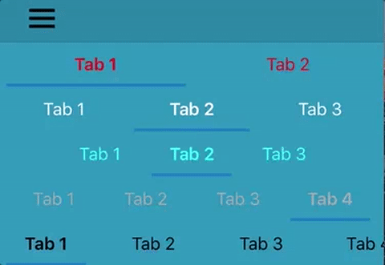
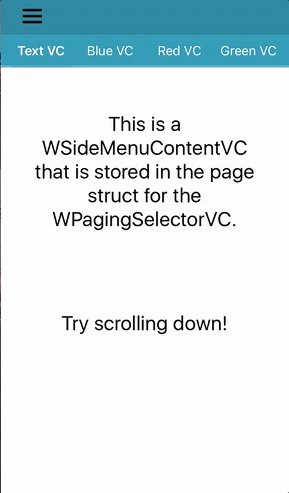
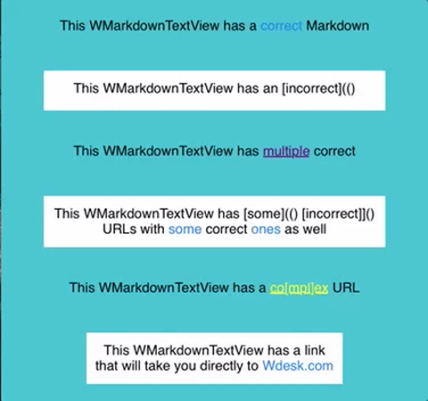
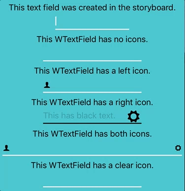
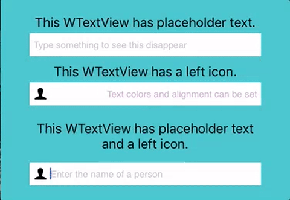

# WMobileKit

[](http://cocoapods.org/pods/WMobileKit)
[](http://cocoapods.org/pods/WMobileKit)
[](http://cocoapods.org/pods/WMobileKit)

WMobileKit is a Swift library containing various custom UI components to provide functionality outside of the default libraries. Each component is customizable and featured in a sample app to demonstrate its functinality!

### Index
* [Controls](#controls)
* [Information Views](#information-views)
* [Modal Components](#modal-components)
* [Navigation](#navigation)
* [Text Inputs](#text-inputs)
* [Miscellaneous/Utilities](#miscellaneousutilities)

## Features

### Controls
Component | Demo
--- | ---
<b>WRadio</b><br> Web-like radio button that can be tied to a group and automatically select/deselect as expected from a normal radio button. The size and color of the outer and inner circle can be changed as well as the highlight. | 
<b>WSwitch</b><br> Custom switch control emulating Apple's custom switches. Adds the ability to change sizes, colors, and sliding behaviors. | 

### Information Views
Component | Demo
--- | ---
<b>WBadge</b><br> Custom number badge that provides the ability to change color, spacing, shape, location, and how the number displays/expands. | 
<b>WSpinner</b><br> Custom progress spinner allowing for custom colors, the addition of images.  | 
<b>WUserLogoView</b><br> An image used to represent a user. Can use either a name which is hashed into a color or and image that is cropped to fit the view. | 
<b>WAutoLayoutView</b><br> View that automatically adds as many of the provided views as possible to each row as determined by the controller's width and wraps to the next row for any remaining views while adjusting the height to fit the content. | 

### Modal Components
Component | Demo
--- | ---
<b>WActionSheet</b><br> Custom action sheets providing the ability to include a picker view, automatically scale to content, scroll, include a cancel button, and tap to dismiss. | 
<b>WBanner</b><br>  Static banners that display information over content from the top or bottom. Can be automatically dismissed or on tap. | 
<b>WLoadingModal</b><br> Displays a loading view over content. Can dim the background view and will disappear after a set period of time. | 
<b>WToast</b><br> Toast that displays from the top/bottom or sides and can be customized to dismiss on tap or via a timer. The color, text, and transparency can be customized. | 

### Navigation
Component | Demo
--- | ---
<b>WPagingSelectorControl</b><br> Custom paging control that allows scrolling headers, automatically spaced headers and button actions to display a view controller. | 
<b>WPagingSelectorVC</b><br> View controller leveraging the WPagingSelectorControl. | 
<b>WSideMenuVC</b><br> Custom side menu drawer. Displays view controllers as cells that can be tapped to swap the main view. | 

### Text Inputs
Component | Demo
--- | ---
<b>WAutoCompleteTextView</b><br> Text view that provides suggestions as you type. | 
<b>WMarkdownTextView</b><br> Text view that interprets and displays markdown text. | 
<b>WTextField</b><br> UITextField with expanded functionality. | 
<b>WTextView</b><br> UITextView with expanded functionality. | 

### Miscellaneous/Utilities
Component | Description
--- | ---
<b>WSizeVC</b><br> | Base view controller that responds to and sends size change related events. Supports iPad Pro/Air split views.  
<b>WTheme</b><br> | Component that allows for simple theme creation that can be used throughout an app.  
<b>WUtils</b><br> | Random useful methods.  

## Usage

To use the library in your app, add the following import to your file:
```swift
import WMobileKit
```

To run the example project, run `./setup.sh` in the root directory.
Alternatively, you can run `pod install` from the Example directory.

## Requirements

 - `use_frameworks!` must be at the top of your Podfile (since this is a Swift pod)
 - iOS 8.0+
 - Xcode 6.0

## Installation

Add the following to your Podfile:
```ruby
pod "WMobileKit"
```

## Sample App Setup

Run the following in the root directory
```ruby
./setup.sh
```

### Known Issues

#### use_frameworks missing

Error:
```ruby
[!] Pods written in Swift can only be integrated as frameworks; this feature is still in beta. Add `use_frameworks!` to your Podfile or target to opt into using it. The Swift Pod being used is: WMobileKit
    Warning: Command failed:  Use --force to continue.
```

Solution:
- Add `use_frameworks` to the top of your Podfile

## License

WMobileKit is available under the Apache license. See the LICENSE file for more info.

## Authors
- James Romo
- Jordan Ross
- Jeff Scaturro
- Todd Tarbox
- Brian Blanchard
- Bryan Rezende
